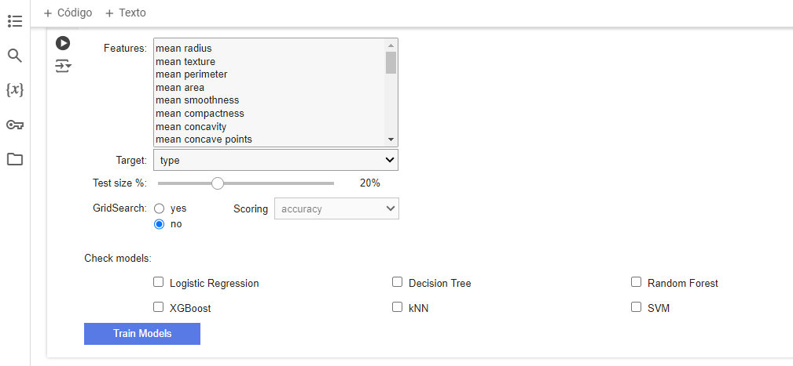

# Machine Learning low-code tool 
   

An interactive Python tool for training and evaluating machine learning classifiers, facilitating feature selection, classifier choice, and performance assessment through an intuitive user interface. Supports a variety of models and comprehensive performance metrics, compatible with Jupyter Notebooks and IPython kernel. Watch the demonstration video in`ML Classifiers.mp4`.

## Features

- **Interactive Feature Selection:** Select multiple features and target variables using dropdown menus.
- **Model Selection:** Choose from a variety of classifiers, including Logistic Regression, Decision Tree, Random Forest, XGBoost, kNN, and SVM.
- **Dynamic Hyperparameter Tuning:** Adjust hyperparameters using sliders and checkboxes.
- **Performance Evaluation:** Compute and display metrics such as accuracy, precision, recall, F1-Score, and AUC-ROC.
- **ROC Curve Visualization:** Plot ROC curves for all selected models in a single graph for comparative analysis.

## Requirements

- Python 3.6 or higher
- Python Libraries:
  - Pandas
  - Numpy   
  - Matplotlib
  - IPyWidgets
  - scikit-learn 
  - xgboost

> **NOTE:**
> The notebook file (`MLClassifiers.ipynb`) can be executed using different platforms for running notebooks, such as Jupyter Notebook and Google Colab.
>- **Jupyter Notebook**: Run the notebook on your machine with the support of a web application.
>- **Google Colab**: Execute your notebook in Google Cloud.

  <em>Train your data</em>

